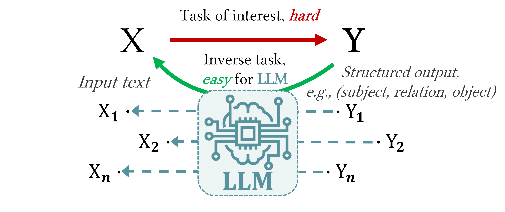
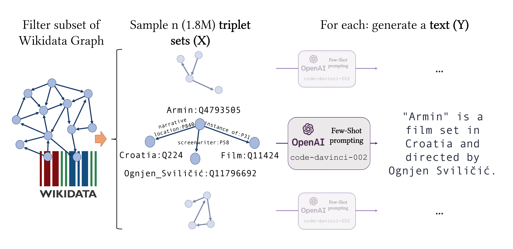

[](https://www.python.org/downloads/release/python-390/)
[](LICENSE)
[](https://arxiv.org/abs/2303.04132)

# Exploiting Asymmetry for Synthetic Training Data Generation: SynthIE and The Case of Information Extraction

This repository contains the PyTorch implementation for the models and experiments in [Exploiting Asymmetry for Synthetic Training Data Generation: SynthIE and the Case of Information Extraction](https://arxiv.org/abs/2303.04132)

```
@article{josifoski2023exploiting,
  title={Exploiting Asymmetry for Synthetic Training Data Generation: {S}ynth{IE} and The Case of Information Extraction},
  author={Josifoski, Martin and Sakota, Marija and Peyrard, Maxime and West, Robert},
  journal={arXiv preprint arXiv:2303.04132},
  year={2023}
}
```
**Please consider citing our work, if you found the provided resources useful.**<br>

---
## 1. The Idea and the Repository in a Nutshell

The corresponding paper builds on the idea that even for hard tasks of interest (with input X and Y) -- for which human-annotation is not practical and high-quality annotated data is not available -- by reversing the task (from Y to X), useful data can be synthetically generated even when that original task cannot be solved directly by the LLM. The idea is illustrated in the following figure:

<div align="center">

</div>

This process enables the creation of a high-quality dataset of X-Y pairs that will enable the training/fine-tuning of models for the original task of interest.
In particular, the paper studies the idea in the context of closed information extraction (IE), where a model is tasked with extracting the exhaustive set of facts expressed in natural language text. The synthetic data generation pipeline proposed in the paper, depicted on the figure below, comprises three primary components: (i) construction of a knowledge graph containing the entities and relations of interest; (ii) sampling of coherent triplet sets from the KG with comprehensive coverage of the entities and relations, and (iii) generation of high-quality text, expressing the triplets without any supplementary information. For more details regarding the dataset construction procedure, see the [paper](https://arxiv.org/abs/2303.04132).

<div align="center">

</div>

We used this pipeline to generate two large high-quality datasets:<br>
- **SynthIE-code**: consisting of around 1.8M training, 10K validation, and 50K test samples generated with [code-davinci-002](https://platform.openai.com/docs/models/gpt-3-5) <br>
- **SynthIE-text**: consisting of 10K validation and 50K test samples generated with [text-davinci-003](https://platform.openai.com/docs/models/gpt-3-5) <br>
The text for the validation and test data points in SynthIE-code and SynthIE-text corresponds to the same triplet sets.

The resulting data is then used to train SynthIE, a series of T5-based versions of [GenIE](https://github.com/epfl-dlab/GenIE) -- a recently proposed autoregressive closed IE system. As a baseline, T5 versions of GenIE are trained on the same dataset, [REBEL](https://aclanthology.org/2021.findings-emnlp.204.pdf), as the original work. This repository contains the code and instructions for downloading and using the data and models, as well as reproducing all the experiments in the paper.

The codebase is built upon [PytorchLightning](https://www.pytorchlightning.ai/) and [Hydra](https://hydra.cc/).

## 2. Environment Setup

With the repository cloned, we recommend creating a new [conda](https://docs.conda.io/en/latest/) virtual environment:
```bash
conda env create -n synthie
conda activate synthie
```

Install [PyTorch](https://pytorch.org/) 1.13.0. For example using pip and with CUDA 11.3 support:
```bash
pip install torch==1.13.0+cu113 torchvision==0.12.0+cu113 torchaudio==0.11.0+cu113 torchmetrics==0.10.3 -f https://download.pytorch.org/whl/torch_stable.html
```

Finally, install the remaining packages using pip:
```bash
pip install -r pip_requirements.txt
```

## 3. Downloading the Data and Models, Usage Instructions & Examples

The [demo notebook](notebooks/demo.ipynb) provides a full review of the provided resources and instruction on how to use them.

## 4. Training, Inference & Evaluation

### Training
Each of the provided models is associated with a Hydra configuration file that reproduces the training. For instance, to run the training for the <code>synthie_base_fe</code> model run:
```
MODEL=synthie_base_fe # synthie_base_fe, synthie_base_sc, synthie_large_fe, genie_base_fe
python run_train.py +experiment/train=$MODEL
```

### Inference
[Hydra](https://hydra.cc/docs/intro/) provides a clean interface for evaluation. You just need to specify the model to be evaluated and the dataset to evaluate it on:
```
MODEL=synthie_base_fe # synthie_base_fe, synthie_base_sc, synthie_large_fe, genie_base_fe

# The name of the dataset
DATAMODULE=rebel_pc  # "rebel_pc", "sdg_code_davinci_002_pc", "sdg_text_davinci_003_pc"

python run_inference.py +experiment/inference=$model datamodule=$DATAMODULE

# For unconstrained generation add: ++model.constraint_module=null at the end of the call
```
The generated prediction sequences will be logged to [Weights and Biases](https://wandb.ai/site).

### Evaluation

To compute the micro and macro performance, as well as the performance bucketed by relation frequency and number of target triplets, you only need the run's WandB path and to execute:

```
python run_process_predictions.py +experiment/process_predictions=complete_rebel wandb_run_path=$WANDB_PATH
```

---
### License
This project is licensed under the terms of the MIT license.
